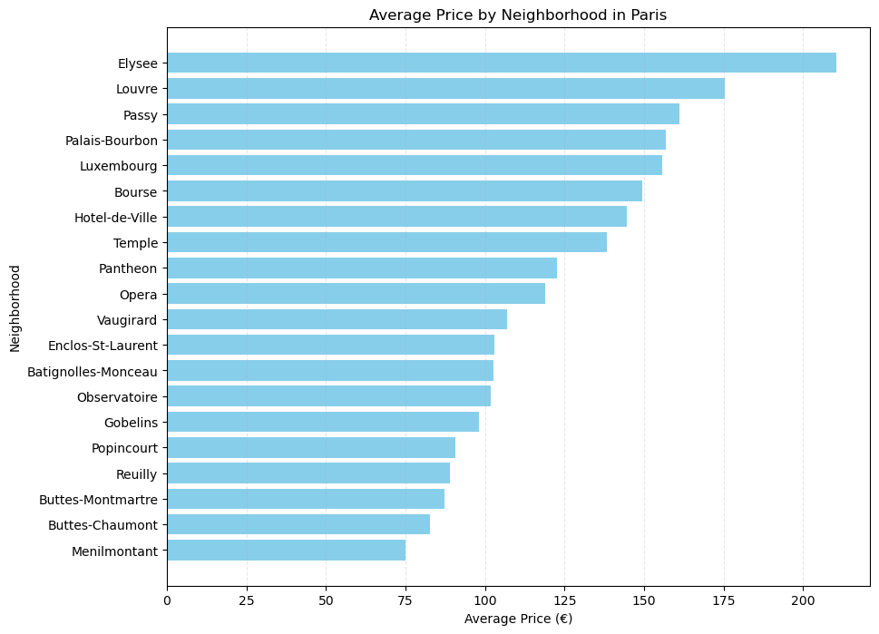
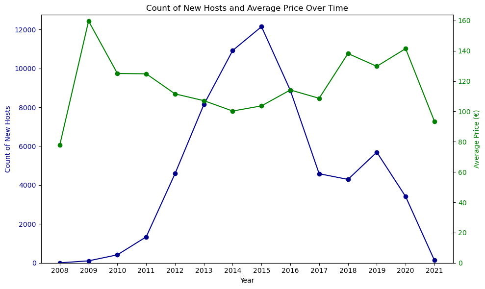

# AirBnb Listing Analysis

## Introduction

This project aims to analyze Airbnb listings in Paris to evaluate the impact of recent regulations on host behavior and pricing trends. By examining data from Airbnb listings, I seek to uncover insights that can inform stakeholders about the effectiveness of regulatory measures and their implications for the hospitality market in Paris.

The key steps in this analysis includes:

- Data Profiling, Quality Assurance and Data Preparation
- Data Cleaning, Preparation and Descriptive Analysis
- Data Visualization and Insights

## Analysis

**1. Data Profiling and Validation:**
- The Source Data for the AirBnb listings can be viewed [here](https://drive.google.com/file/d/1Zeh6VSc5813ufJRHR1w-nmFtdsv7fncr/view?usp=drive_link) !
- As the first step of analysis, identified the multiple features included in the listings dataset and sample values
- Checked and handled missing values and outliers using Pandas library

**2. Data Cleaning, Preparation and Descriptive Analysis:**
- Filtered the dataset to only include listings in "Paris" Listings and relevant columns for analysis
- Cleaned and transformed the data - for e.g., convereted date columns like 'host_since' to datetime_format using Python's datetime functionalities
- Aggregated the datasets by neighbourhood and accomodation types
- Obtained the descriptive statistics for price over time across multiple neighborhoods and accomodation types and also identified the trends of new hosts over time

**3.Data Visualization**:
- Utilized Matplotlib and Seaborn for visualizing average prices by neighborhood and accommodation types using bar plots
- Analyzed trends in new host registrations over time and their correlation with pricing changes with line charts

## Observations & Insights 

**1.Pricing Trends:** Analysis shows that the average number of average number of people an Airbnb listing in Paris can accommodate is approximately 3, with a mean price of €113.10. Prices range from €0 to €12,000, with significant variation (standard deviation of €214.43)
- The wide range in prices indicates diverse offerings in the market, catering to different guest capacities and price points
- Listings that accommodate more people generally have higher prices, suggesting that larger properties command a premium

**2. Pricing is Correlated to Accomodation Capacity:** Listings that accommodate more people tend to have progressively higher average prices, with prices reaching up to €971 for properties accommodating 
14 people
- This correlation between accommodation size and price suggests that larger properties are positioned as more luxurious or suitable for larger groups, justifying the higher rates.
- Hosts with larger properties can target families or groups, potentially increasing their revenue

**3. Neighborhood price variations:** Neighborhoods with higher average prices, such as Elysee, Louvre (€175.38), and Passy (€161.14), are likely more desirable due to their location and proximity to tourist attractions or upscale amenities
- ***Elysee:*** Close to the Champs-Élysées, luxury shopping, and the presidential palace
- ***Louvre:*** Near the famous Louvre Museum and other historic landmarks
- ***Passy:*** Located in the upscale 16th arrondissement, known for its high-end residential areas and proximity to the Eiffel Tower.

**4. Trends in Host Registrations and Prices Over Time:** The number of new hosts peaked in 2015 with 12,147 new registrations. The average prices show fluctuations over the years, with a noticeable increase in recent years, peaking at €141.46 in 2020
- The peak in new host registrations in 2015 may correlate with a growing interest in short-term rentals around that time
- The subsequent fluctuation in average prices could be influenced by market adjustments, regulatory changes, or external factors such as tourism trends and economic conditions

**5. Seasonal Fluctuations:** There are clear seasonal fluctuations in the pricing of Airbnb listings, with higher prices typically observed during peak tourist seasons. This indicates that demand for short-term rentals in Paris is highly influenced by tourism patterns. Hosts may adjust their pricing dynamically to capitalize on periods of high demand

## Strategic Recommendations

- To achieve market balance, it's essential to revise regulatory policies to promote growth while addressing entry barriers for new hosts. Continuous monitoring and evaluation of policy impacts are crucial for making timely adjustments and supporting a balanced market. 
- Encouraging long-term rentals through tax breaks or reduced fees can help stabilize occupancy rates
- Providing educational resources for fair pricing strategies ensures that hosts set competitive prices, maintaining affordability and market competitiveness. Additionally, offering support to new and existing hosts can help them navigate regulations and optimize their listings

## Conclusion

The comprehensive analysis of Airbnb listings in Paris demonstrates the critical role of data profiling, aggregation, and visualization in uncovering market trends and insights. Utilizing these data analysis skills, we can make informed recommendations to optimize regulatory policies, enhance host strategies, and ultimately ensure a balanced and sustainable Airbnb market.

## How to Use
To replicate this analysis: Clone this repository to your local machine and run the Jupyter Notebooks provided in the repository, following the step-by-step instructions outlined.

